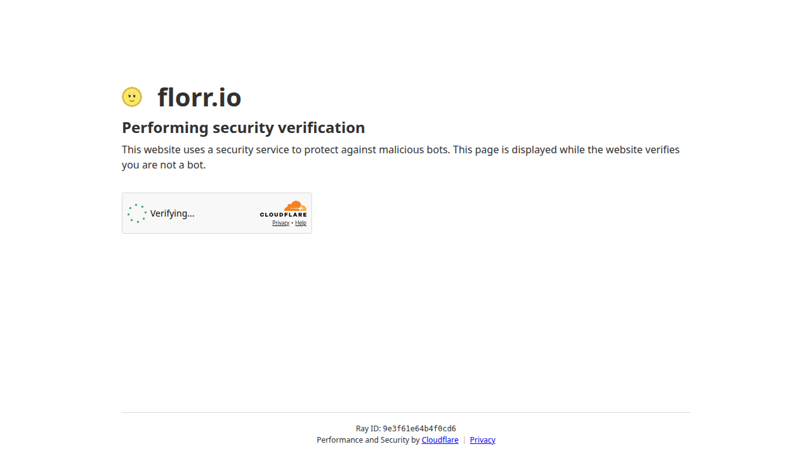

# 🌸 Florr Powerful Tools

> 🤖 AI-Powered Automation Toolkit for [florr.io](https://florr.io) — Smart AFK protection, auto-pathfinding, combat AI, and custom model training

[](https://python.org)
[](LICENSE)
[]()
[]()
[](https://github.com/PANP2010/florr_powerful_tools/actions/workflows/ci.yml)
[]()

---

## 🎯 What is This?

**Florr Powerful Tools** is a comprehensive automation framework for the popular [florr.io](https://florr.io) browser game. It combines computer vision, deep learning, and path-planning algorithms to provide intelligent game assistance — without cheating, just making the game more enjoyable.

Whether you need AFK protection, want to auto-navigate maps, train custom AI models, or collect training data — this toolkit has you covered.



---

## ✨ Key Features

| Feature | Description | Status |
|---------|-------------|--------|
| 🛡️ **AFK Protection** | Auto-detect & solve AFK verification challenges | ✅ Stable |
| 🗺️ **Auto Pathfinding** | Lazy Theta* algorithm for intelligent navigation | ✅ Stable |
| ⚔️ **Auto Combat** | Smart mob detection, targeting & fighting | ✅ Stable |
| 🧠 **AI Training** | Build custom models with PyTorch + YOLO26 | ✅ Stable |
| 📊 **Data Collection** | Harvest gameplay data for model training | ✅ Stable |
| 📸 **Visual Testing** | Browser screenshot + functional test harness | ✅ New |

---

## 🚀 Quick Start

### Prerequisites

- Python 3.9–3.11
- Windows 10/11, macOS, or Linux
- (Optional) GPU for training

### Installation

```bash
# Clone the repo
git clone https://github.com/PANP2010/florr_powerful_tools.git
cd florr_powerful_tools

# Create virtual environment
python -m venv venv
source venv/bin/activate        # Linux/macOS
# venv\Scripts\activate.bat     # Windows

# Install dependencies
pip install -r florr_assistant/requirements.txt

# Install Playwright for browser testing (optional)
pip install playwright
playwright install chromium
```

### Run the Assistant

```bash
cd florr_assistant
python main.py
```

### Run Tests

```bash
# Full test suite (screenshot + module tests)
bash browser_test_env/run_all_tests.sh

# Module tests only
python browser_test_env/module_tester.py

# Screenshot tests only
python browser_test_env/screenshot_tester.py --florr
```

---

## 🏗️ Project Architecture

```
florr_powerful_tools/
├── florr_assistant/             # 🧠 Main integrated assistant
│   ├── core/                    # Core services (engine, logger, config, platform)
│   ├── ui/                      # PyQt5 UI (main window, overlay, data collection)
│   └── modules/                 # Feature modules
│       ├── afk/                 # AFK detection & response
│       ├── pathing/             # Navigator + map classifier
│       ├── combat/              # Fighter + target selector
│       ├── data_collector/       # Training data collection
│       └── stats/               # Statistics gathering
│
├── browser_test_env/            # 🆕 Browser test harness (Playwright)
│   ├── screenshot_tester.py    # Headless screenshot capture
│   ├── module_tester.py         # Import & functionality tests
│   └── run_all_tests.sh         # One-command test runner
│
├── florr-auto-afk-main/         # Standalone AFK detection
├── florr-auto-pathing/          # Standalone pathfinding
├── florr-auto-framework-pytorch/ # AI training framework
├── florr-auto-sszone/           # Auto mob zone farming
│
├── upload_package/              # 📦 Kaggle training package
├── train_package/               # 🏋️ Local training package
└── florr_knowledge_base/        # 📚 Game wiki & data
```

---

## 🛡️ AFK Protection

Never get kicked for being idle again. The AFK module:

- Uses **YOLO** models (`afk-det.pt`, `afk-seg.pt`) to detect AFK windows (>90% accuracy)
- Plans a path through verification using an improved **Dijkstra** algorithm
- Responds to LLM-powered chat challenges
- Integrates via **WebSocket** browser extension (Tampermonkey)

```python
# Quick test
cd florr-auto-afk-main
pip install -r py311-requirements.txt
python segment.py
```

---

## 🗺️ Auto Pathfinding

Built on the **Lazy Theta\*** path-planning algorithm — smarter than A* because it accounts for line-of-sight:

- ✅ **8-map support**: Ocean, Desert, Jungle, Garden, Hel, Anthell, Sewers, and more
- ✅ **Real-time player position detection** via HSV color filtering
- ✅ **Stuck detection & recovery** with random directional nudges
- ✅ **Configurable target maps** and navigation intervals

```python
# Quick test
cd florr-auto-pathing
python main.py
```

---

## ⚔️ Auto Combat

Fight smarter, not harder:

- **YOLO mob detection** across 77+ mob types
- **Priority-based targeting** with rarity weighting (Mythic 3.7×, Ultra 1.8×, Legendary 0.6×)
- **Auto-equip switching** and petal management
- **Sandstorm detection & avoidance**

```python
# Quick test
cd florr-assistant
python -c "from modules.combat import Fighter; print('Combat module loaded')"
```

---

## 🧠 AI Training Framework

Train your own custom models:

| Model | Architecture | Input | Output |
|-------|-------------|-------|--------|
| Base | 3-layer MLP | 73-dim state | 5-dim action |
| Attention | Multi-head attention | 73-dim state | 5-dim action |

**Training stack:** PyTorch + Ultralytics YOLO26 + NumPy

```bash
# Kaggle / Google Colab (free GPU)
!python scripts/train_cloud.py --mode all --num-samples 5000 --epochs 100 --batch 16

# Local (needs GPU)
python scripts/train_cloud.py --mode all --num-samples 10000 --epochs 150 --batch 32
```

**YOLO26 vs YOLOv8:**

| Metric | YOLOv8s | YOLO26s | Improvement |
|--------|---------|---------|-------------|
| mAP50-95 | 44.8% | **48.6%** | +3.8% |
| Params | 11.2M | **9.5M** | -15% |
| CPU speed | baseline | **+43%** | faster |

---

## 🧪 Testing

The project includes a **browser test harness** powered by Playwright:

```bash
# Run everything
bash browser_test_env/run_all_tests.sh

# Just module import tests
python browser_test_env/module_tester.py

# Screenshot tests
python browser_test_env/screenshot_tester.py --florr
python browser_test_env/screenshot_tester.py --url https://github.com
```

**Test coverage:**

| Category | Status |
|----------|--------|
| Core modules (logger, config, engine, events) | ✅ Pass |
| Feature modules (AFK, pathing, combat, data) | ✅ Pass |
| OpenCV (cv2) | ✅ Pass |
| PyTorch | ⚠️ Optional |
| YOLO (ultralytics) | ⚠️ Optional |
| GUI (PyQt5) | ⚠️ Needs display |

---

## ⚙️ Configuration

### Main config: `config/default.yaml`

```yaml
modules:
  afk:
    enabled: true
    idle_threshold: 10
    detection_interval: 3

  pathing:
    enabled: true
    target_map: "ocean"
    avoid_danger: true

  combat:
    enabled: false
    safe_distance: 200
    attack_distance: 150

ui:
  theme: "dark"   # light / dark
  language: "zh-cn"  # en-us / zh-cn
```

---

## 🔧 Development

### Add a new module

```python
from florr_assistant.modules.base import BaseModule

class MyModule(BaseModule):
    name = "my_module"
    version = "1.0.0"
    description = "My awesome feature"
    priority = 50  # Lower = runs later
    dependencies = []  # e.g. ["map_classifier"]

    def _on_start(self):
        self._log("My module started")

    def _on_tick(self):
        pass  # Called every loop iteration

    def _on_stop(self):
        self._log("My module stopped")
```

---

## 📜 Tech Stack

| Category | Technologies |
|----------|-------------|
| Language | Python 3.9+ |
| Computer Vision | OpenCV, PIL, NumPy |
| Deep Learning | PyTorch, Ultralytics (YOLO26) |
| GUI | PyQt5, Tkinter |
| Automation | PyAutoGUI, PyWin32, mss |
| Web | FastAPI, WebSocket |
| Testing | Playwright, pytest |

---

## 🤝 Contributing

Contributions are welcome! Please:

1. Fork the repo
2. Create a feature branch (`git checkout -b feature/AmazingFeature`)
3. Commit your changes (`git commit -m 'Add AmazingFeature'`)
4. Push to the branch (`git push origin feature/AmazingFeature`)
5. Open a Pull Request

---

## 📄 License

GPL v3 — see [LICENSE](LICENSE) for details.

---

## 🙏 Acknowledgements

- [Shiny-Ladybug](https://github.com/Shiny-Ladybug) — original florr-auto-afk project
- [Ultralytics](https://github.com/ultralytics) — YOLO framework
- The florr.io community 💐

---

*Made with ❤️ for the florr.io community*
